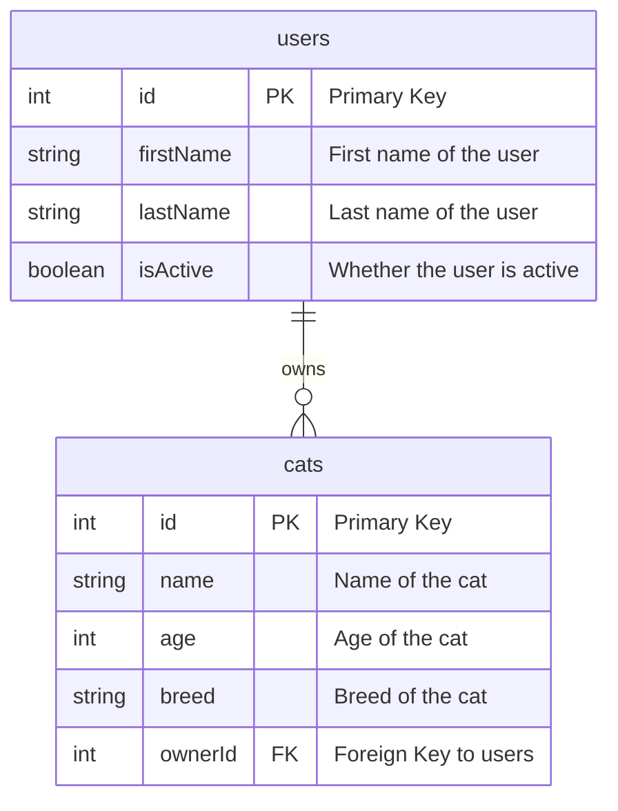

## Entity-Relation Diagram

```mermaid
erDiagram
    users {
        int id PK "Primary Key"
        string firstName "First name of the user"
        string lastName "Last name of the user"
        boolean isActive "Whether the user is active"
    }

    cats {
        int id PK "Primary Key"
        string name "Name of the cat"
        int age "Age of the cat"
        string breed "Breed of the cat"
        int ownerId FK "Foreign Key to users"
    }

    users ||--o{ cats : owns
```

