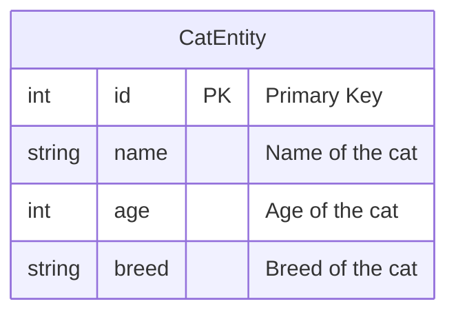

## Entity-Relation Diagram

```mermaid
erDiagram
    CatEntity {
        int id PK "Primary Key"
        string name "Name of the cat"
        int age "Age of the cat"
        string breed "Breed of the cat"
    }
```

